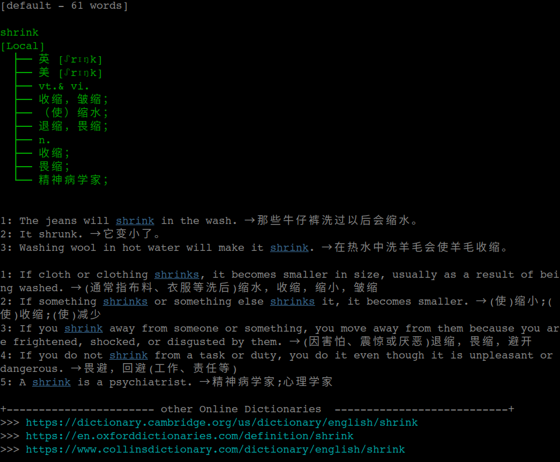



# 安装
>
1. ```pip3 install -r requirements.txt```
2. 需要firefox --headless及geckodriver的支持，如无(例如仅有chrome)，则修改lib/driver.py并运行lib/jscb.py通过测试也可。
3. database/dic.db[下载地址](https://pan.baidu.com/s/1L1XwrMZxEuJ7HWOeASChfw)   **n841**
4. 注意python3与utf-8编码问题，及ascii颜色码

---

# 简介

测试平台: ubuntu x64 desktop

**author**: Zhaopeng Zhang

**usage**: 

```python dic.py -h```

1. 从金山词霸网站爬取单词释义, 发音链接，双语例句，collins释义等内容，并存入数据库database/dic.db
2. 单词释义等存入指定单词库文本文件database/yourdir/yourdic.txt
3. 单词发音mp3文件存入音频文件夹audio/

```python review.py -h```

1. 复习文本词库中的单词
2. 默写单词

```python simple_dic.py -h```

1. **与dic.db配合可以直接实现简单查词功能**
2. **不依赖与其他脚本**

```python tools.py```

1. 删除空白音频文件.
2. 从dic.db批量获取音频链接并下载.
3. 融合dic.db文件夹下其余sqlite3 db.
4. 剔除dic.db中释义或例句为空的条目.
5. 获取dic.db的基本信息.
6. 根据单词列表，从dic.db获取文本释义库.

---

# 注意

```
alias 'dic'='python dic.py'
alias 'review'='python review.py'
```

# 用法

## 查询单词

```
# 查询单个单词
dic -w hello

#进入查询模式
dic

# 指定存入词库查询
dic -d TOEFL/list01

# 创建单词库的方法(版本更改后已失效)
ls *.txt | parallel -j 4 "python3 dic.py -es -d {}.txt -f {} --db {}.db"
```

## 复习单词
```
# 复习default database
review

# 指定词库复习，database下存在TOEFL/list01.txt
review -d TOEFL/list01

# 听写模式
review -t

更多用法python review.py -h / review -h
```
